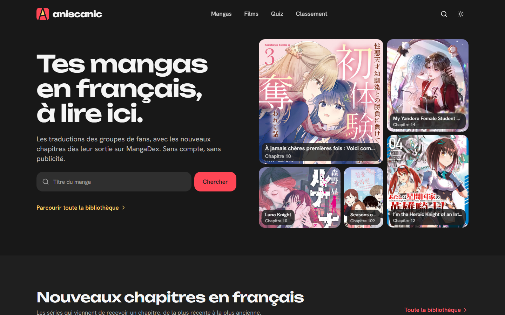
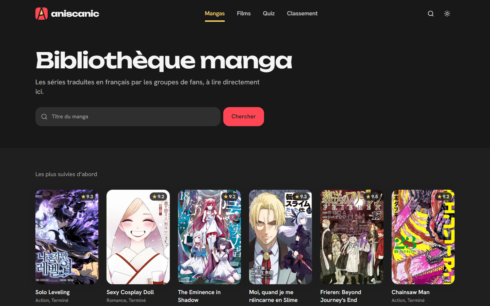
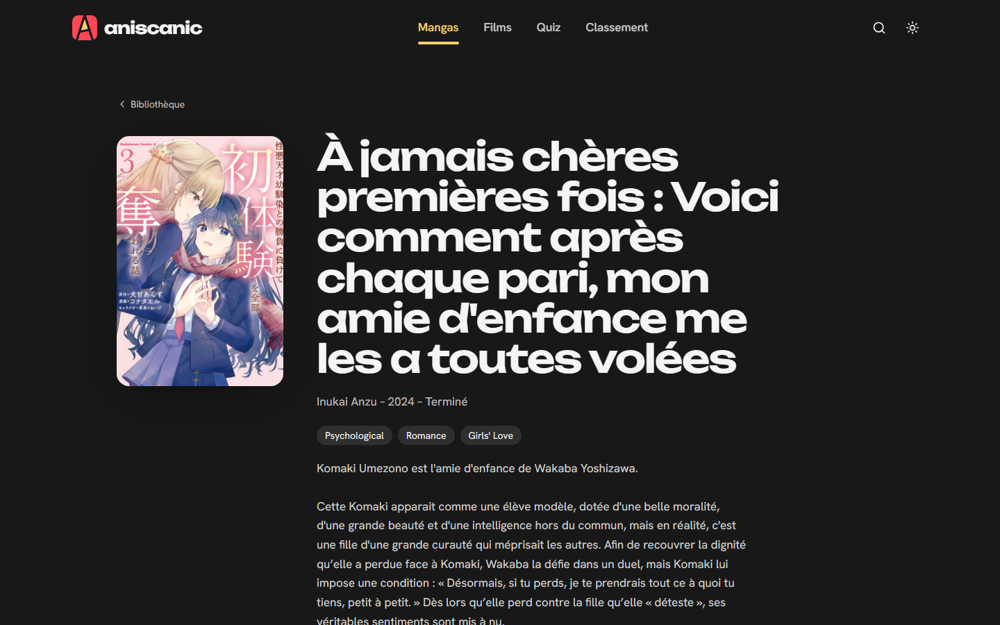
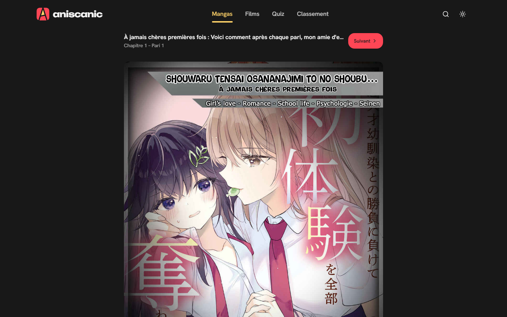
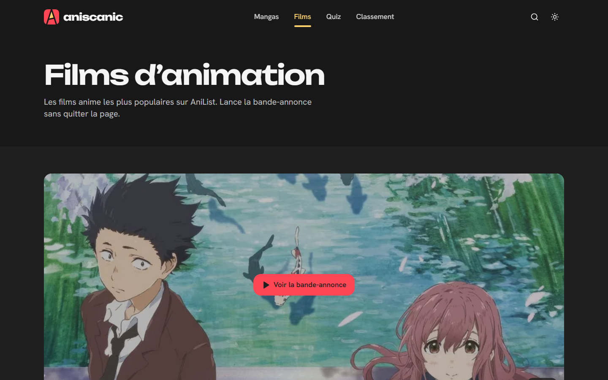
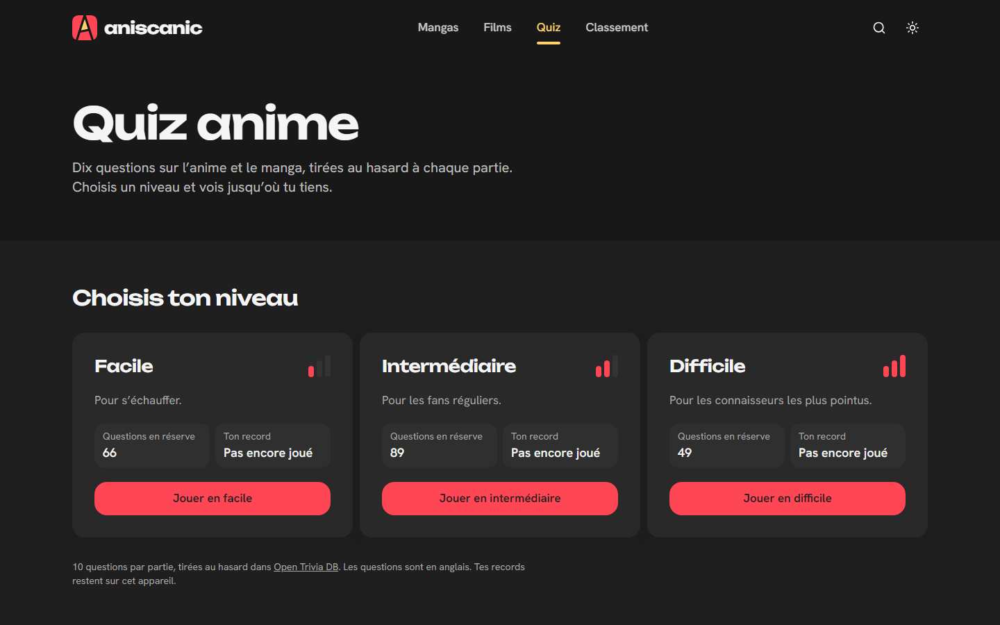
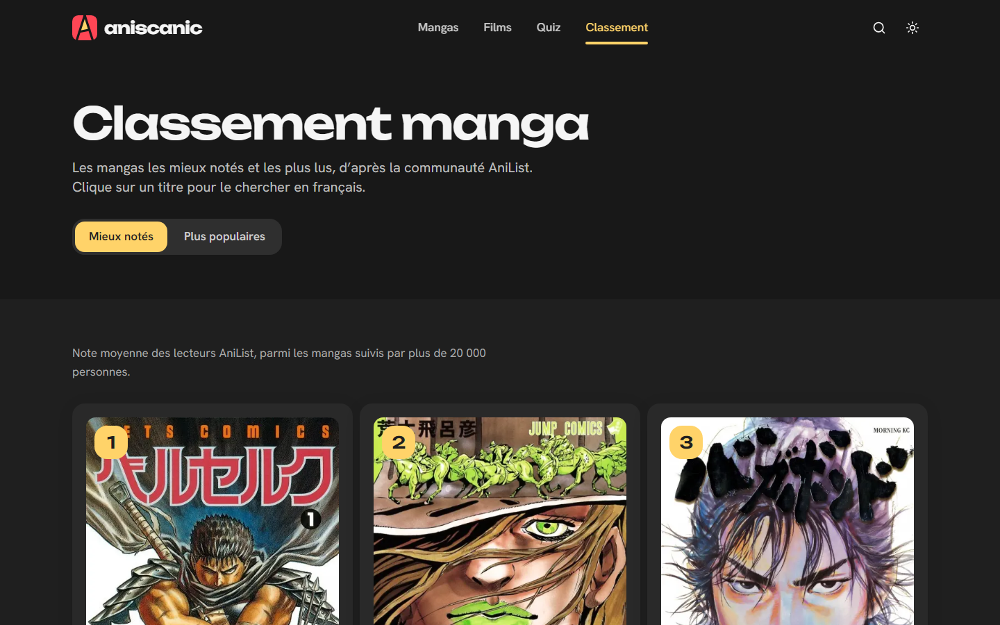
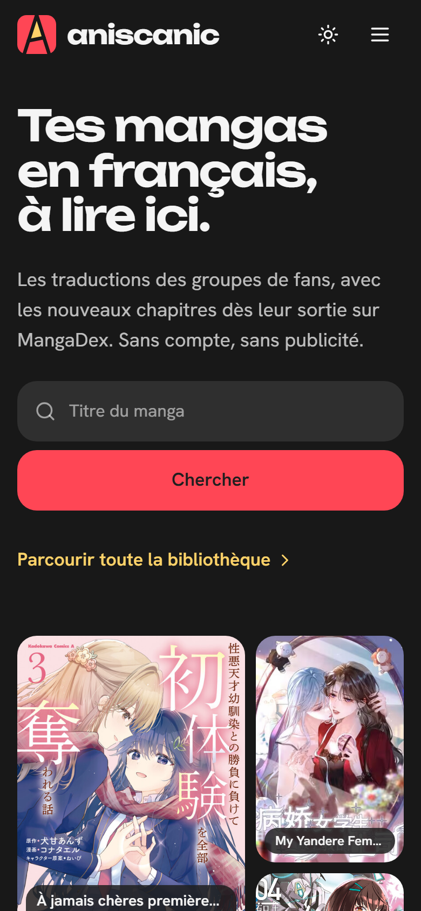

<div align="center">

# aniscanic

**Read manga in French, discover anime films, and test your otaku knowledge - no account, no ads.**

Aniscanic is a French-language web app built on live public APIs: fan translations from MangaDex,
films and rankings from AniList, and quiz questions from Open Trivia DB.



</div>

## Features

| | |
|---|---|
| **Latest French releases** | The homepage shows series that just received a new French chapter on MangaDex, newest first. |
| **Manga library & search** | Browse the most-followed French-translated series or search by title, with MangaDex ratings. |
| **Built-in reader** | Read chapters page by page directly on the site, with previous/next chapter navigation. |
| **Anime films** | The most popular anime films on AniList, with trailers playing inline (privacy-enhanced YouTube embed). |
| **Quiz** | 10 random anime & manga questions per game across three difficulty levels. Personal bests are stored in the browser only. |
| **Rankings** | Top-rated and most-popular manga according to the AniList community. |
| **Light & dark themes** | Dark by default; the choice is remembered and applied before first paint (no flash). |

Every number on the site comes from an API or from the visitor's own device. Nothing is invented.

## Screenshots

<table>
  <tr>
    <td width="50%"><br><sub><b>Library</b> - <code>/manga</code></sub></td>
    <td width="50%"><br><sub><b>Series page</b> - <code>/manga/[id]</code></sub></td>
  </tr>
  <tr>
    <td><br><sub><b>Reader</b> - <code>/manga/[id]/chapter/[chapterId]</code></sub></td>
    <td><br><sub><b>Films</b> - <code>/movie</code></sub></td>
  </tr>
  <tr>
    <td><br><sub><b>Quiz</b> - <code>/quiz</code></sub></td>
    <td><br><sub><b>Rankings</b> - <code>/ranking</code></sub></td>
  </tr>
</table>

<p align="center">
  <br>
  <sub><b>Mobile</b> - homepage at 390px</sub>
</p>

## Tech stack

- [Next.js 15](https://nextjs.org) (App Router, Turbopack in dev) with React 19 and TypeScript
- [Tailwind CSS v4](https://tailwindcss.com) with design tokens as CSS custom properties, plus `tw-animate-css`
- UI primitives following the [shadcn/ui](https://ui.shadcn.com) pattern (CVA + Radix Slot + tailwind-merge)
- [Lucide](https://lucide.dev) icons, [Framer Motion](https://motion.dev) for animation
- Fonts: Unbounded (headlines) and Hanken Grotesk (body)

## Getting started

**Prerequisites:** Node.js 20+ and [pnpm](https://pnpm.io).

```bash
git clone https://github.com/Yobson2/aniscanic.git
cd aniscanic/aniscanic
pnpm install
pnpm dev
```

Then open <http://localhost:3000>.

**No API keys or environment variables are needed.** MangaDex, AniList and Open Trivia DB are all free, keyless APIs.

### Scripts

| Command | Description |
|---|---|
| `pnpm dev` | Start the dev server with Turbopack |
| `pnpm build` | Create a production build |
| `pnpm start` | Serve the production build |
| `pnpm lint` | Run ESLint |

## Data sources

| Source | Used for | Client | Cache |
|---|---|---|---|
| [MangaDex API](https://api.mangadex.org/docs/) | Latest releases, library, search, series details, chapters, reader pages, ratings | `src/lib/api/mangadex.ts` | 10 min |
| [AniList GraphQL](https://docs.anilist.co) | Popular anime films and trailers, manga rankings | `src/lib/api/anilist.ts` | 1 h |
| [Open Trivia DB](https://opentdb.com) | Quiz questions (category "Anime & Manga") | `src/lib/api/opentdb.ts` | 1 day for question counts |

All API calls happen on the server. Pages are React Server Components that fetch data directly and
show an explanatory message instead of crashing when an API is unavailable.

### MangaDex image proxy

MangaDex serves a different image to hotlinked requests, and it does not allow CORS from third-party
sites. Covers and chapter pages therefore go through a small proxy route,
[`src/app/api/mangadex/image/route.ts`](src/app/api/mangadex/image/route.ts), which:

- only fetches from `uploads.mangadex.org` and `*.mangadex.network` over HTTPS
- refuses redirects (a 3xx could point outside the allowlist)
- only returns raster images (JPEG, PNG, GIF, WebP) with `nosniff` and a sandboxed CSP
- caches responses for 24 hours, since a given image URL never changes

AniList images are loaded directly through `next/image` (allowed in `next.config.ts`).

## Project structure

```
src/
├── app/                         # App Router pages
│   ├── page.tsx                 # Home: hero + latest French chapters
│   ├── manga/                   # Library/search, series page, chapter reader
│   ├── movie/                   # Anime films
│   ├── quiz/                    # Quiz
│   ├── ranking/                 # AniList rankings
│   ├── api/mangadex/image/      # MangaDex image proxy
│   └── layout.tsx               # Header, footer, theme script, fonts
├── components/
│   ├── home/planche.tsx         # Hero panel grid of latest releases
│   ├── quiz/quiz-game.tsx       # Client-side quiz game
│   ├── ui/                      # Button, input, logo primitives
│   └── …                        # Header, footer, cards, search form
├── lib/
│   ├── api/                     # MangaDex, AniList, Open Trivia DB clients
│   ├── quiz-records.ts          # Personal quiz records (localStorage)
│   ├── tokens.ts                # Design tokens
│   └── utils.ts                 # cn() class helper
├── i18n/fr.ts                   # French UI strings
└── constants.tsx                # Route definitions
```

## Conventions

- **Internal links** use the `routes` object from `@/constants`, never hard-coded paths.
- **Theming** uses CSS tokens (`bg-background`, `bg-card`, `text-muted-foreground`, `text-accent-text`…)
  and the `.dark` class on `<html>`, not props.
- **Contrast:** text on the brand red (`#FF4655`) is dark, because white fails WCAG AA. Red text uses
  `text-accent-text`.
- **Interactivity** lives in small client components; everything else stays a server component.
- The path alias `@/*` maps to `src/*`.

See [`CLAUDE.md`](CLAUDE.md) for the full set of project guidelines.

## Privacy

There are no accounts, analytics or ads. The only things stored are kept in the visitor's own browser:
the theme preference (`aniscanic-theme`) and quiz records (`aniscanic-quiz-records`).

## Credits

Manga content and translations belong to their authors and to the scanlation groups who publish them on
[MangaDex](https://mangadex.org). Film and ranking data come from [AniList](https://anilist.co), quiz
questions from [Open Trivia DB](https://opentdb.com) (CC BY-SA 4.0). Aniscanic is an unofficial fan
project and is not affiliated with any of these services.
